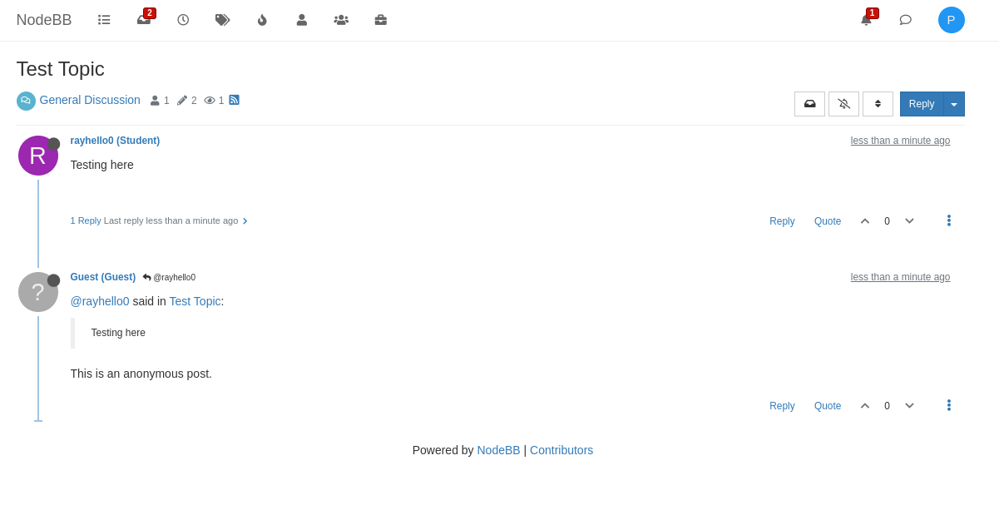
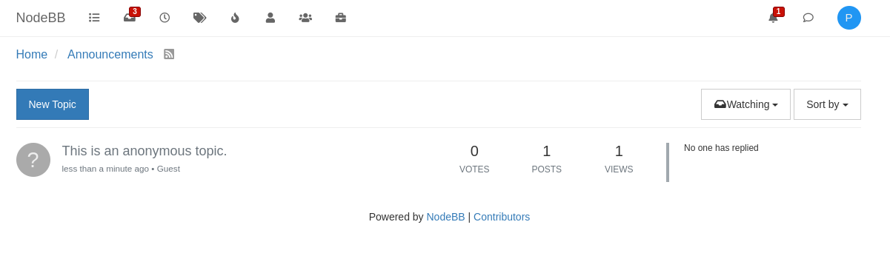

# Search bar implementation (Front End + Routing)

## How to use feature

- Please run the app using ./nodebb start. The feature will be apparent in the general discussion page (home → general discussion) only while the user is logged in. The user then is able to type a prompt into the search bar. The search bar should then see a loading animation for the circle buttons, and will proceed to route the data to the backend. (WIP - the search display feature is not implemented yet, however the data flow can be seen with inspect element)

## Test

- To test the inputs going through the system, inspect the page’s elements, navigate to the console, then there will be an output of what the prompt is through console logging. However, the routing feature to the search displays is a work in progress due to time constraints left from Sprint 1.  
- As this functionality is mainly within the front-end, and does not use API calling for proper routing, a regular test/file was not able to be successfully created. Attempts were made to create the test file through local testing that tested functionalities of - “should log search prompt when run”, “should display error messages for search results”, and “should show routing progress while calling”. However this was not possible through default testing and is still a WIP.  

# Student/Instructor labels

## How to use feature

- When viewing posts on NodeBB with the default theme, users will have a tag by their name that lists their account type (Student or Instructor), or Administrator if they are an administrator.
- Since this feature required adding an extra field to users, thus changing the database, a fresh installation of NodeBB using ```nodebb setup```, then ```nodebb build``` and ```nodebb start```, may be required to successfully see this change.

## Test

- As largely all that was done was adding this extra field and making changes to ensure that it was correctly passed to the post partial and displayed there, the only test I added was to assert that this field existed and was populated correctly. These tests can be found in the ```tests/user.js``` file.

# Anonymous posting (Posting as guest)

## How to use feature

- The Anonymous posting functionality allows users to post topics and replies as guests, thus leaving no user information to any other user on the platform to observe. The functionality is implemented as a new post composer plugin that supports the functionality; users need to load the plugin with the compatible NodeB codebase to activate the functionality.

- First, since the anonymous post composer is a submodule in this directory, make sure the submodule is cloned together with the main repository using the following commands:

``` shell
# if not cloned yet
$ git clone 'this repository'
 
$ git submodule init
$ git submodule update
```

- To use the beta anonymous posting feature, users need to first link the beta anonymous post composer using the following commands:

``` shell
# from NodeBB root directory
$ cd ./plugins/nodebb-plugin-composer-anonymous/
$ npm link
$ cd ../..
$ npm link nodebb-plugin-composer-anonymous
```

- Then build NodeBB in the normal fashion:

```shell
# if not yet set up
$ ./nodebb setup 

$ ./nodebb build
$ ./nodebb start
```

- The anonymous post composer should be automatically enabled. If it is not, go to the admin setting and click the extend tab. Choose the plugin option and manually switch the default composer to the anonymous composer.

- Now, when turning up the composer, the user should be able to see the dropdown button near the composer. Enter text for your post and click "Submit Anonymous" and communicate anywhere, anytime as the guest!

### On Desktop


### On Mobile Devices


### Example Anonymous Post



### Example Anonymous Topic



## Test

- The test suite can be found in the file [./test/anonymous.js](https://github.com/CMU-313/spring24-nodebb-over-20/blob/f538d6c8d8f37bdce927a945461b8027fe6202e6/test/anonymous.js). The tests are included in the full test suite of NodeBB, so to run the test, simply run:

``` shell
$ npm run test
```

- The test cases for anonymous posting includes checking if the user displayed is the guest user instead of the actual author of the post, as well as making sure that the addition and the deletion of posts are not affected by the addition of the anonymous posting feature. The anonymous post also should not count towards the total number of posts of the post author. These tests are sufficient since they demonstrate that the anonymous posting functionality is working as expected and meets the definition of successful when we define the user stories.
